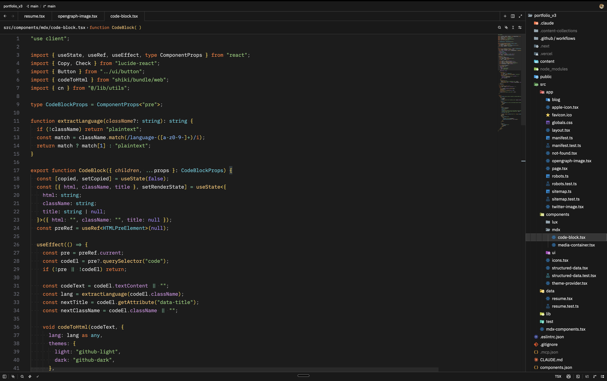
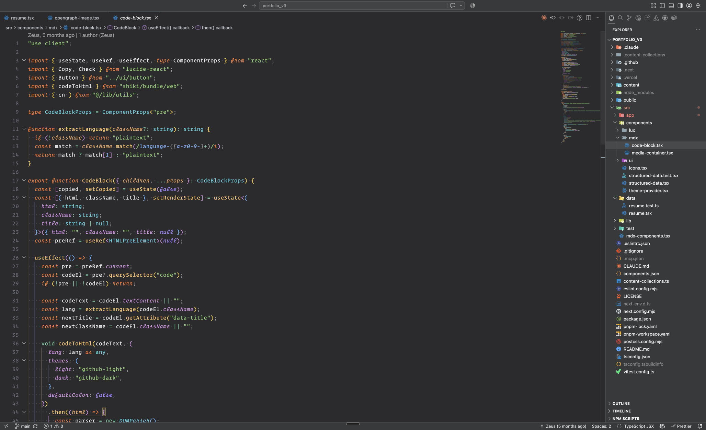

# Black Frieza

A balanced dark theme for **Zed** and **VS Code** — neither too light nor too dark, built to work day and night.

Born from [New Darcula](https://github.com/e-simpson/new-darcula-z) with one goal: keep its balance, but make the colors *pop*. Saturated syntax highlighting, a terminal that matches the sidebar instead of pitch black, and matte accents — khaki for new files, a single violet for everything interactive.

<!-- screenshots: add assets/zed-black-frieza.png and assets/vscode-black-frieza.png, then uncomment

*Black Frieza (Zed)*

*Black Frieza (VS Code)*
-->

## Variants

| Variant | Editor | Chrome | Best for |
| --- | --- | --- | --- |
| **Black Frieza** | `#2b2b2d` | `#37393b` | Daytime, bright rooms |
| **Black Frieza Darker** | `#1c1c1c` | `#191919` | Nighttime, dark rooms |

Both share the same syntax palette:

| Token | Color | |
| --- | --- | --- |
| Keywords | `#ff7832` | vivid orange |
| Functions | `#ffc66d` | Darcula gold |
| Types & interfaces | `#54d1e0` | cyan |
| Properties | `#d291e0` | orchid |
| Strings | `#8fd177` | green |
| Constants & enum members | `#a88aff` | violet |
| Parameters | `#f0a967` *italic* | amber |
| New / untracked files | `#a9b665` | muted khaki |
| Accent (links, badges) | `#a37acc` | matte violet |

Design principles: the terminal background always matches the panels (no black hole at the bottom of your editor), explorer text is white so git states are readable at a glance, and nothing is neon — bright colors are reserved for code.

## Install — Zed

Until the extension lands in the Zed registry:

1. Download [`themes/black-frieza.json`](themes/black-frieza.json)
2. Drop it in `~/.config/zed/themes/`
3. `cmd-k cmd-t` → pick **Black Frieza** or **Black Frieza Darker**

Once published: `cmd-shift-p` → `zed: extensions` → search **Black Frieza** → Install.

## Install — VS Code / Cursor

1. Grab the `.vsix` from the [latest release](https://github.com/dylandifilippo/black-frieza/releases)
2. In VS Code: `cmd-shift-p` → **Extensions: Install from VSIX…**
3. `cmd-k cmd-t` → pick **Black Frieza** or **Black Frieza Darker**

Works in Cursor the same way.

## Credits

- [New Darcula](https://github.com/e-simpson/new-darcula-z) by Evan Simpson — the foundation (MIT)
- [Colorizer](https://github.com/tamimhasandev/colorizer) by Md Tamim Hasan — saturation inspiration
- [Vercel Theme](https://github.com/NathanBrodin/zed-vercel-theme) by Nathan Brodin — contrast inspiration
- JetBrains Darcula — the ancestor of it all

## License

[MIT](LICENSE)
